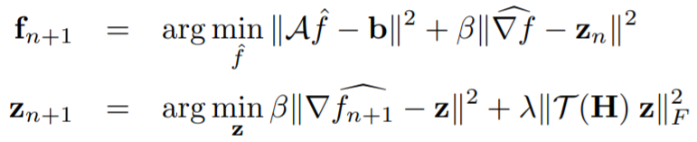

# OMODL: Off-The-Grid Model Based Deep Learning
OMODL is a model based off-the grid image reconstruction algorithm that uses deep learned priors. The main difference of the proposed scheme with current deep learning strategies is the learning of non-linear annihilation relations in Fourier space. It relies on a model based framework, with a significantly smaller deep network, compared to direct approaches that also learn how to invert the forward model. It reconstructs Single-channel Sparse MRI. Preliminary comparisons against image domain MoDL approach demonstrates the potential of the off-the-grid formulation. The main benefit of the proposed scheme compared to structured low-rank (SLR) methods is the quite significant reduction in computational complexity.

## Relevant Paper
Pramanik, Aniket, Hemant Aggarwal, and Mathews Jacob, "Off-The-Grid Model Based Deep Learning (O-MODL)", 2019 IEEE 16th International Symposium on Biomedical Imaging (ISBI). https://ieeexplore.ieee.org/document/8759403 

It won the ```Best Machine Learning Paper Award``` in IEEE ISBI 2019 conference held in Venice, Italy.
 
## Recursive OMODL Network


The network solves for two variables by alternating between



### Benefits of OMODL
1. It outperforms strutured low-rank (SLR) methods in terms of performance in SNR.

2. It is three orders of magnitude faster than SLR methods.


## Results


## OMODL Code
This is a tensorflow implementation of OMODL network for Single-channel Sparse MRI reconstructions. OMODL is a model-based deep learning approach that significantly reduces the computational complexity of Structured low-rank (SLR) algorithms. It uses k-space annihilation relations to interpolate unknown k-space samples. The codes have been written in python-3.7 using the Tensorflow-v1.15 library.

### Single-channel MRI Dataset
The datasets used for single channel experiments are single-channel T1-weighted brain MRI from the Calgary-Campinas Public (CCP) dataset in (https://sites.google.com/view/calgary-campinas-dataset). The single-channel complex valued images are generated by coil combination of 12-channel T1-weighted brain MRI. There are 25 subjects for training, 10 for validation and 10 for testing. There are 256 axial slices per subject with a dimension of 256 x 170.\
A testing dataset is uploaded as test_2_img_axial.npy which consists of two axial slices of 256 x 170 from a subject unseen by the network during training. 

### Description of Python scripts

```trn_OMODL.py``` : It is the training code for single-channel sparse MRI recovery. The OMODL model is trained on 25 subjects with single-channel brain slices described above.

```tst_OMODL.py``` : It is the code for testing a pre-trained model on the test dataset uploaded as test_2_img_axial.npy. The pre-trained model is inside the directory 'savedModels'. This is meant for Single-channel Sparse MRI recovery. 

```data_processing_functions.py``` : Dataset preparation related functions are defined in this script.

```OMODL.py``` : Defines the OMODL network architecture. 

## Contact
The code is meant for reproducible research. In case of any difficulty, please open an issue or directly email me at aniket-pramanik@uiowa.edu 

